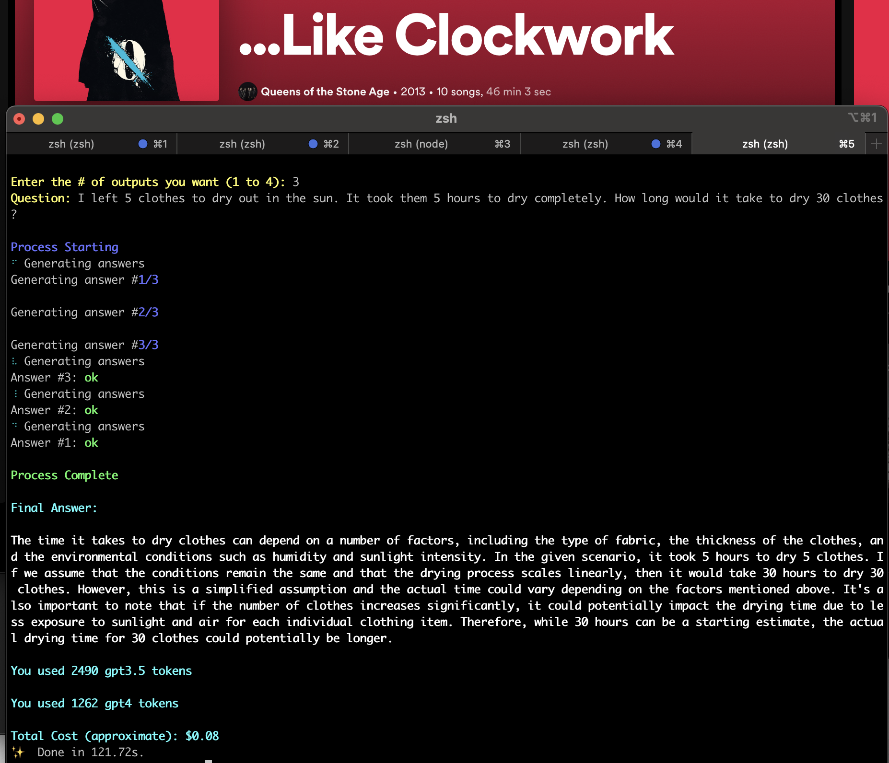

# SmartGPT implementation

## Introduction

This is the implementation of a system proposed in the video [GPT 4 is Smarter than You Think: Introducing SmartGPT](https://youtu.be/wVzuvf9D9BU?si=zX9rR_iFKLTpzmsB). The app uses 3 different GPT agents (generator, researcher, resolver) to come up with the best answer. The user prompts the app with a question, and the generator fetches a x number of answers. The researcher then evaluates the answers and lists the pros and cons of each answer. The resolver then resolves the question by choosing the best answer. This system should yield better results then a zero-shot answer (when a single GPT agent is used to answer the question).

## Local Setup

Clone the repository, install the requirements and run the script:

```
yarn install
yarn dev
# or yarn build && yarn start
```

## Usage

The script will guide you interactively after you start it in the terminal.

## Examples



The answer in the example is still wrong though :D

## Technologies used

- [Node.js](https://nodejs.org/en/)
- [TypeScript](https://www.typescriptlang.org/)
- [OpenAI API](https://www.npmjs.com/package/openai)
- [Ink](https://github.com/vadimdemedes/ink)
