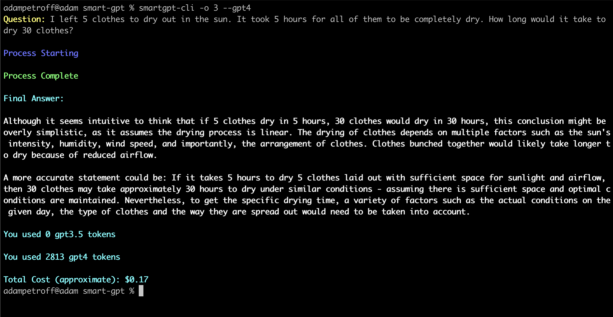

# SmartGPT implementation

## Introduction

This is an implementation of a system proposed in the video [GPT 4 is Smarter than You Think: Introducing SmartGPT](https://youtu.be/wVzuvf9D9BU?si=zX9rR_iFKLTpzmsB). The app uses 3 different GPT agents (generator, researcher, resolver) to come up with the best answer. The user asks a question, and the generator fetches an x number of answers. The researcher then evaluates the answers and lists the pros and cons of each answer. The resolver then chooses the best answer and tries to improve it based on the feedback from the researcher. This system should yield better results then a zero-shot answer (when a single GPT agent is used to answer the question in one prompt).

The app is using GPT-3.5 for the generator and the researcher, and GPT-4 for the resolver.

## Installation

```
npm i -g smartgpt-cli
```

## Local Setup

Clone the repository, install the requirements and run the script:

```
yarn install
yarn dev
# or yarn build && yarn start
```

Create a `.env` file in the root of the project and add your OpenAI API key:

```
OPENAI_KEY=your-key-here
```

## Usage

The script will guide you interactively after you start it in the terminal.

```
smartgpt-cli
```

Options:

- `--help` - show help (optional)
- `--question` - the question to ask (optional)
- `--outputs` `-o` - the number of answers to generate and pick from (optional)

## Screenshot




The answer in the example is still wrong though :D

## Technologies / Libraries used

- [Node.js](https://nodejs.org/en/)
- [TypeScript](https://www.typescriptlang.org/)
- [OpenAI API](https://www.npmjs.com/package/openai)
- [Chalk](https://www.npmjs.com/package/chalk)
- [Ora](https://www.npmjs.com/package/ora)

## Potential TODOs

- Code could be split into multiple files, although it's not that big of a project
- Try using [Ink](https://github.com/vadimdemedes/ink) for better CLI outputs
